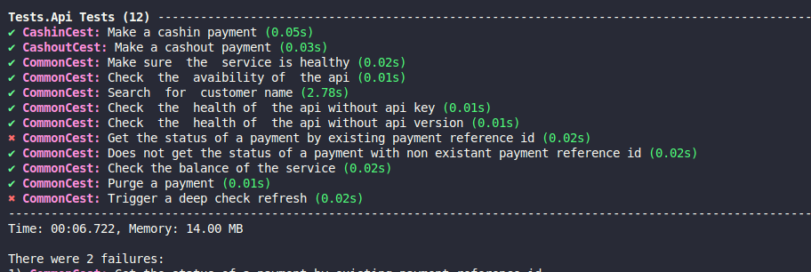

# Connector Test Framework for REH Trainee (Mentorship)

## Features
This project is a test framework for the Digitech connector, designed for REH trainees as part of a mentorship program. It uses Codeception for API testing and Docker for managing test environments.

## Screenshot of Running Tests


## How to Start the Project Locally
1. **Clone the repository**:
   ```bash
   git clone https://github.com/daryl-maviance/Codeception-UAT-Connector
   cd Codeception-UAT-Connector
   ```

2. **Ensure Docker and Docker Compose are installed** on your machine.

3. **Install and configure AWS CLI**:
   ```bash
   sudo apt update && sudo apt install unzip -y
   curl "https://awscli.amazonaws.com/awscli-exe-linux-x86_64.zip" -o "awscliv2.zip"
   unzip awscliv2.zip
   sudo ./aws/install
   complete -C '/usr/local/bin/aws_completer' aws
   aws configure  # Add your AWS key, secret, region, and format
   ```

4. **Authenticate with AWS credentials**:
   ```bash
   make auth2
   ```

5. **Pull the Digitech connector image**:
   ```bash
   make digitech-pull
   ```

6. **Build the Docker containers**:
   ```bash
   make build
   ```

7. **Start the services**:
   ```bash
   make up
   ```

8. **Run the tests**:
   ```bash
   make execute-test
   ```

## Framework
The project uses the following frameworks:
- **Codeception**: A PHP testing framework for API testing.
- **Docker**: For containerized environments.

## Development Commands
- **Build**: Build the Docker containers.
  ```bash
  make build
  ```
- **Start Services**: Start the services in the background.
  ```bash
  make up
  ```
- **Stop Services**: Stop the services.
  ```bash
  make stop
  ```
- **Reset Services**: Stop, clean, rebuild, and start the services.
  ```bash
  make reset
  ```
- **Clean**: Remove Docker containers and orphans.
  ```bash
  make clean
  ```
- **Application Logs**: View application logs.
  ```bash
  make app-logs
  ```
- **Test Logs**: View test logs.
  ```bash
  make test-logs
  ```
- **Application Shell**: Open a bash shell as root in the application container.
  ```bash
  make app-root
  ```
- **Test Shell**: Open a bash shell as root in the test container.
  ```bash
  make test-root
  ```
- **Execute Tests**: Run tests in the test container.
  ```bash
  make execute-test
  ```

## Configuration Parameters
Configuration parameters are defined in the `variables.env` file. Ensure the necessary environment variables are properly configured before starting the services.

Example content of the `variables.env` file:
```env
DIGITECH=<digitech_connector_image>
APPLICATION_ENV=testing
MYSQL_HOST=mysql
```

## Notes
- Ensure all dependencies are installed before running the project.
- Use the provided `Makefile` commands for easier management of the project lifecycle.

